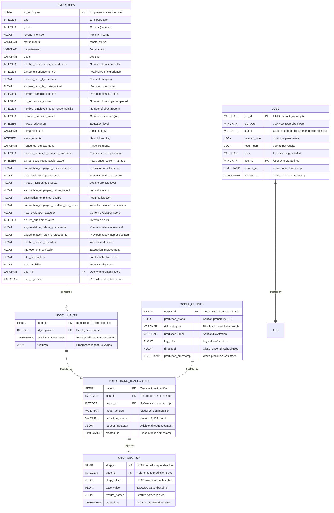
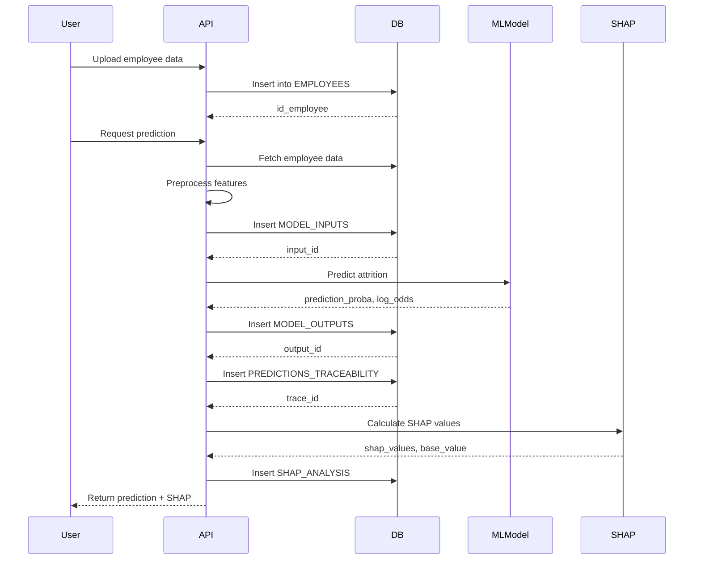

# Entity-Relationship Diagram

## Database Schema Overview

This document describes the relational database schema for the HR Attrition Rate prediction system. The database consists of 6 main entities that track employees, predictions, SHAP explanations, and background jobs.

## ER Diagram (Mermaid)



## Entity Descriptions

### 1. EMPLOYEES
**Purpose**: Stores raw employee data from HR systems (SIRH, evaluations, surveys).

**Key Characteristics**:
- Primary key: `id_employee` (auto-incremented)
- Contains 35+ employee attributes covering demographics, job details, satisfaction scores
- Supports multi-tenancy via `user_id` field
- Tracks data ingestion timestamp for audit purposes

**Relationships**:
- One employee → Many model inputs (1:N)

### 2. MODEL_INPUTS
**Purpose**: Captures preprocessed feature vectors sent to the ML model for prediction.

**Key Characteristics**:
- Primary key: `input_id` (auto-incremented)
- Foreign key: `id_employee` references EMPLOYEES
- Stores features as JSON for flexibility (supports schema evolution)
- Timestamps when prediction was requested

**Relationships**:
- Many model inputs → One employee (N:1)
- One model input → One prediction trace (1:1)

### 3. MODEL_OUTPUTS
**Purpose**: Stores ML model predictions and risk assessments.

**Key Characteristics**:
- Primary key: `output_id` (auto-incremented)
- Stores prediction probability (0-1 scale)
- Categorizes risk as Low/Medium/High
- Includes log-odds for advanced analysis
- Tracks classification threshold used

**Relationships**:
- One model output → One prediction trace (1:1)

### 4. PREDICTIONS_TRACEABILITY
**Purpose**: Links model inputs and outputs for full audit trail and explainability.

**Key Characteristics**:
- Primary key: `trace_id` (auto-incremented)
- Foreign keys: `input_id`, `output_id`
- Tracks model version for reproducibility
- Records prediction source (API/UI/Batch)
- Stores request metadata (user info, session data)

**Relationships**:
- One trace → One model input (1:1)
- One trace → One model output (1:1)
- One trace → One SHAP analysis (1:1)

### 5. SHAP_ANALYSIS
**Purpose**: Stores SHAP (SHapley Additive exPlanations) values for model interpretability.

**Key Characteristics**:
- Primary key: `shap_id` (auto-incremented)
- Foreign key: `trace_id` (unique constraint ensures 1:1 with traces)
- Stores SHAP values as JSON array (one value per feature)
- Includes base value (expected model output)
- Feature names array for mapping SHAP values to features

**Relationships**:
- One SHAP analysis → One prediction trace (1:1)

### 6. JOBS
**Purpose**: Manages asynchronous background tasks (report generation, batch predictions).

**Key Characteristics**:
- Primary key: `job_id` (UUID)
- Tracks job lifecycle: queued → processing → completed/failed
- Stores job parameters as JSON (payload_json)
- Stores job results as JSON (result_json)
- Supports multi-tenancy via `user_id`
- Tracks creation and update timestamps

**Relationships**:
- Many jobs → One user (N:1, implicit)

## Data Flow



## Indexes and Performance

**Recommended Indexes** (for production):

```sql
-- Primary keys (auto-indexed)
CREATE INDEX idx_employees_pk ON employees(id_employee);
CREATE INDEX idx_model_inputs_pk ON model_inputs(input_id);
CREATE INDEX idx_model_outputs_pk ON model_outputs(output_id);
CREATE INDEX idx_predictions_traceability_pk ON predictions_traceability(trace_id);
CREATE INDEX idx_shap_analysis_pk ON shap_analysis(shap_id);
CREATE INDEX idx_jobs_pk ON jobs(job_id);

-- Foreign key indexes
CREATE INDEX idx_model_inputs_employee ON model_inputs(id_employee);
CREATE INDEX idx_predictions_trace_input ON predictions_traceability(input_id);
CREATE INDEX idx_predictions_trace_output ON predictions_traceability(output_id);
CREATE INDEX idx_shap_analysis_trace ON shap_analysis(trace_id);

-- Query optimization indexes
CREATE INDEX idx_employees_user_id ON employees(user_id);
CREATE INDEX idx_jobs_status ON jobs(status);
CREATE INDEX idx_jobs_user_id ON jobs(user_id);
CREATE INDEX idx_predictions_created_at ON predictions_traceability(created_at);
```

## Design Principles

### 1. **Separation of Concerns**
- **Input/Output Separation**: Separate tables for model inputs and outputs allow independent schema evolution
- **Traceability Layer**: Dedicated table links inputs/outputs without tight coupling

### 2. **Auditability**
- All tables have timestamps (`created_at`, `updated_at`, `date_ingestion`)
- `PREDICTIONS_TRACEABILITY` tracks model version and source
- `request_metadata` JSON field captures additional context

### 3. **Flexibility**
- JSON columns (`features`, `shap_values`, `payload_json`) support schema changes without migrations
- Generic `JOBS` table handles multiple job types

### 4. **Multi-Tenancy**
- `user_id` field in `EMPLOYEES` and `JOBS` enables data isolation
- Foreign key relationships maintain data integrity per user

### 5. **Explainability**
- Dedicated `SHAP_ANALYSIS` table ensures interpretability
- 1:1 relationship with traces guarantees every prediction can be explained

## Migration History

1. **Initial Schema** - Core tables (employees, model_inputs, model_outputs, predictions_traceability)
2. **SHAP Integration** - Added `shap_analysis` table for explainability
3. **Background Jobs** - Added `jobs` table for async processing
4. **Multi-Tenancy** - Added `user_id` to employees and jobs
5. **Threshold Tracking** - Added `threshold` column to model_outputs

## Notes

- **Data Types**: PostgreSQL-specific types used (SERIAL, TIMESTAMP WITH TIME ZONE, JSON)
- **Normalization**: Schema is normalized to 3NF (Third Normal Form)
- **JSON Usage**: JSON fields used strategically for flexibility vs. queryability trade-off
- **Future Extensions**: Schema supports adding new feature columns, prediction types, or job types without major refactoring
